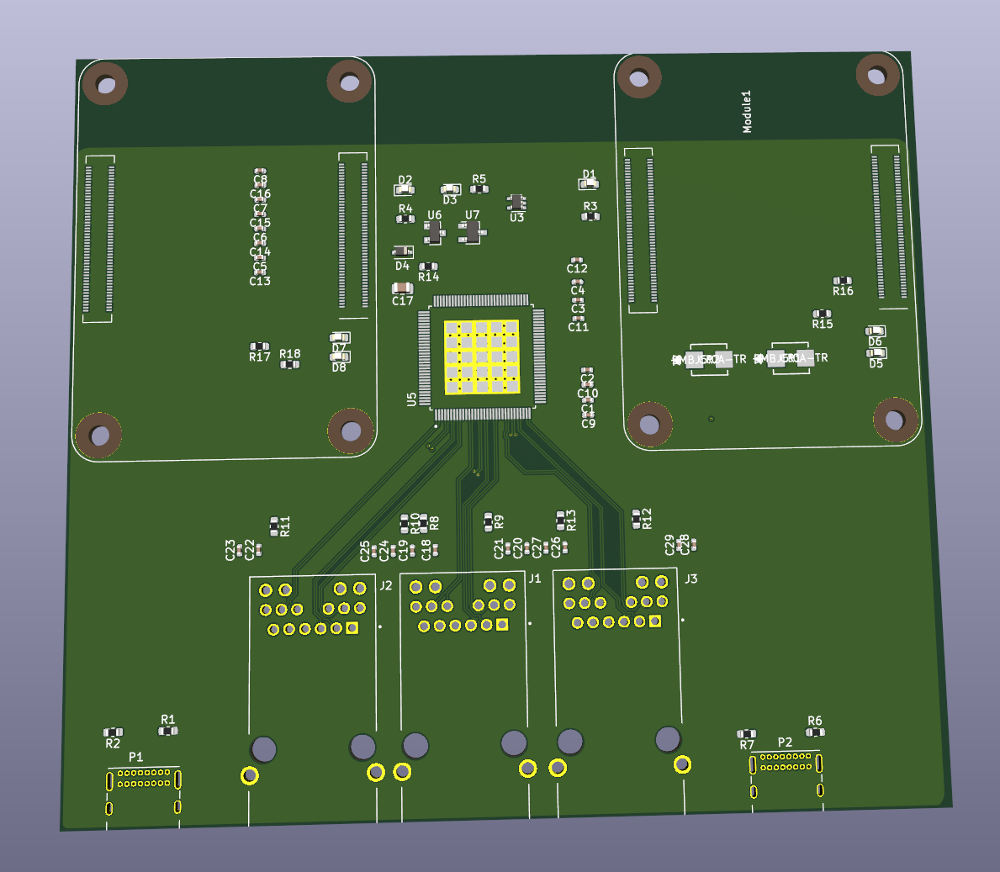

# RPi CM4 - Gigabit switch prototyping board

A raspberry pi cm4 board with integrated gigabit switch.

Two CM4s and three RJ45 Jacks each connected to a [Microchip KSZ9567](https://www.microchip.com/wwwproducts/en/KSZ9567#datasheet-toggle)

In the future I will make a board with four CM4 modules and one RJ45 on the
switch, but for now I am making this so I can test the switch on its own.

However this also makes for an interesting board in its own right, as two
wifi CM4 modules could make this an interesting router board.

## About

This project is maintained by [Taylor Alexander](http://tlalexander.com).

The Raspberry Pi CM4 is a product of [Raspberry Pi (Trading) Limited](https://www.raspberrypi.org/about/).

This Raspberry Pi CM4 switch board was forked from
[Alexander Rau's](https://rpi.loonix.ca) rpi-cm4-LiM-board:
https://github.com/l00nix/rpi-cm4-LiM-board

Alexander Rau forked the rpi-cm4-LiM-board board design from [Shawn Hymel](https://github.com/ShawnHymel/rpi-cm4-base-carrier).
Shawn has a two part youtube series on how to design a CM4 Carrier Board.

- [Part 1 - How to Make a Raspberry Pi Compute Module 4 Carrier Board in KiCad](https://www.youtube.com/watch?v=ypcPJC_umPQ)
- [Part 2 - How to Make a Raspberry Pi Compute Module 4 Carrier Board in KiCad](https://www.youtube.com/watch?v=ge6gYIENo8Q&t)

## License

Schematic and PCB layout files are licensed under the [CC BY 4.0](https://creativecommons.org/licenses/by/2.0/) license.

Individual components and footprints found in the CM4IO library are licensed as
per the Design Files license found [here](https://datasheets.raspberrypi.org/license.html).

THE DESIGN IS PROVIDED "AS IS" AND THE AUTHOR DISCLAIMS ALL WARRANTIES WITH
REGARD TO THIS DESIGN INCLUDING ALL IMPLIED WARRANTIES OF MERCHANTABILITY AND
FITNESS. IN NO EVENT SHALL THE AUTHOR BE LIABLE FOR ANY SPECIAL, DIRECT,
INDIRECT, OR CONSEQUENTIAL DAMAGES OR ANY DAMAGES WHATSOEVER RESULTING FROM
LOSS OF USE, DATA OR PROFITS, WHETHER IN AN ACTION OF CONTRACT, NEGLIGENCE
OR OTHER TORTIOUS ACTION, ARISING OUT OF OR IN CONNECTION WITH THE USE OR
PERFORMANCE OF THIS DESIGN.
